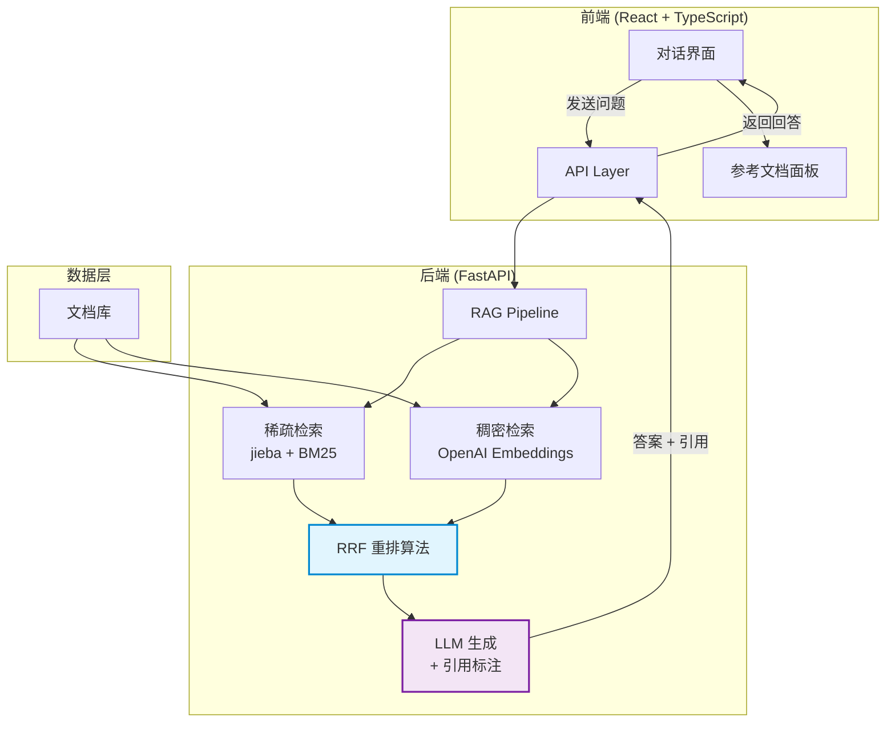

<div align="center">

# 🔍 Hybrid RAG Citation

### 基于混合检索与 RRF 重排的垂域文档智能问答系统

[](https://www.python.org/)
[](https://fastapi.tiangolo.com/)
[](https://react.dev/)
[](https://www.typescriptlang.org/)
[](LICENSE)

</div>

---

## 📖 项目简介

Hybrid RAG Citation 是一个**工业级的文档智能问答系统**，通过融合稀疏检索（BM25）和稠密检索（向量相似度）的优势，实现高精度的文档检索与问答。系统支持**精准引用溯源**，每个回答都附带原文引用，增强可信度。

### ✨ 核心特性

- 🔄 **混合检索引擎** - BM25 稀疏检索 + 向量稠密检索双路召回
- 📊 **RRF 重排算法** - Reciprocal Rank Fusion 多路结果融合
- 📝 **精准引用溯源** - 回答附带 `[Doc_X]` 引用标识，一键定位原文
- 🎯 **中文优化** - jieba 分词 + 中文 Embedding 模型
- 💎 **优雅 UI** - 类 Kimi/智谱清言的对话界面，右侧参考文档面板

---

## 🏗️ 系统架构



---

## 🔬 RRF 算法详解

### 什么是 RRF？

**Reciprocal Rank Fusion (RRF)** 是一种高效的多路检索结果融合算法，由 Cormack 等学者在 2009 年提出。其核心思想是将不同检索器的排名列表进行加权融合。

### 算法公式

$$
\text{RRF\_score}(d) = \sum_{i=1}^{n} \frac{w_i}{k + r(d, i)}
$$

其中：
- $d$ - 文档
- $k$ - 平滑常数（默认 60），防止排名靠前的文档得分过高
- $r(d, i)$ - 文档 $d$ 在第 $i$ 个检索器中的排名
- $w_i$ - 第 $i$ 个检索器的权重

### 为什么选择 RRF？

| 优势 | 说明 |
|------|------|
| 🎯 无需训练 | 即插即用，无需标注数据 |
| 📏 尺度无关 | 对不同检索器的得分尺度不敏感 |
| 🔀 天然融合 | 支持任意数量的检索器 |
| ⚡ 高效计算 | 时间复杂度 O(n)，适合实时应用 |

### 示例计算

假设有两个检索器返回的结果：

| 文档 | BM25 排名 | 向量检索排名 |
|------|-----------|--------------|
| Doc_A | 1 | 3 |
| Doc_B | 2 | 1 |
| Doc_C | 3 | 2 |

RRF 计算（k=60）：
- Doc_A: 1/(60+1) + 1/(60+3) = 0.0164 + 0.0159 = **0.0323**
- Doc_B: 1/(60+2) + 1/(60+1) = 0.0161 + 0.0164 = **0.0325** ⭐
- Doc_C: 1/(60+3) + 1/(60+2) = 0.0159 + 0.0161 = **0.0320**

最终排序：Doc_B > Doc_A > Doc_C

---

## 🛠️ 技术栈

### 后端

| 技术 | 用途 |
|------|------|
| Python 3.10+ | 主语言 |
| FastAPI | Web 框架 |
| uv | 包管理器 |
| jieba | 中文分词 |
| rank_bm25 | BM25 稀疏检索 |
| numpy | 向量计算 |
| langchain-openai | LLM & Embedding API |

### 前端

| 技术 | 用途 |
|------|------|
| React 18 | UI 框架 |
| TypeScript | 类型安全 |
| Vite | 构建工具 |
| TailwindCSS | 样式框架 |

---

## 🚀 快速开始

### 前置要求

- Python 3.10+
- Node.js 18+
- [uv](https://github.com/astral-sh/uv) 包管理器
- OpenAI API Key

### 1. 克隆项目

```bash
git clone https://github.com/yourusername/Hybrid-RAG-Citation.git
cd Hybrid-RAG-Citation
```

### 2. 配置环境变量

```bash
cp backend/.env.example backend/.env
```

编辑 `backend/.env`，填入你的 OpenAI API Key：

```env
OPENAI_API_KEY=sk-your-api-key-here
OPENAI_BASE_URL=https://api.openai.com/v1
LLM_MODEL=gpt-4o-mini
EMBEDDING_MODEL=text-embedding-3-small
```

### 3. 启动后端

```bash
cd backend
uv sync  # 安装依赖
uv run uvicorn app.main:app --reload --port 8000
```

后端将在 http://localhost:8000 启动，API 文档访问 http://localhost:8000/docs

### 4. 启动前端

```bash
cd frontend
npm install  # 安装依赖
npm run dev
```

前端将在 http://localhost:5173 启动

### 5. 一键启动（可选）

```bash
chmod +x start.sh
./start.sh
```

---

## 📁 项目结构

```
Hybrid-RAG-Citation/
├── backend/                    # 后端服务
│   ├── app/
│   │   ├── api/               # API 路由
│   │   │   └── routes.py
│   │   ├── core/              # 配置
│   │   │   └── config.py
│   │   ├── data/              # Mock 数据
│   │   │   └── mock_docs.py
│   │   ├── models/            # 数据模型
│   │   │   └── schemas.py
│   │   ├── services/          # 业务逻辑
│   │   │   ├── sparse_retriever.py   # BM25 稀疏检索
│   │   │   ├── dense_retriever.py    # 向量稠密检索
│   │   │   ├── rrf_fusion.py         # RRF 融合算法
│   │   │   ├── hybrid_retriever.py   # 混合检索 Pipeline
│   │   │   └── llm_service.py        # LLM 调用服务
│   │   └── main.py            # FastAPI 入口
│   ├── pyproject.toml
│   └── .env.example
├── frontend/                   # 前端应用
│   ├── src/
│   │   ├── components/        # React 组件
│   │   │   ├── ChatMessage.tsx
│   │   │   ├── ChatInput.tsx
│   │   │   └── ReferencePanel.tsx
│   │   ├── services/          # API 调用
│   │   ├── types/             # TypeScript 类型
│   │   ├── App.tsx            # 主应用
│   │   └── main.tsx           # 入口
│   └── package.json
├── start.sh                    # 一键启动脚本
├── TODO.md                     # 开发任务清单
└── README.md                   # 项目说明
```

---

## 📚 API 文档

### 查询接口

```http
POST /api/query
Content-Type: application/json

{
  "query": "什么是 RRF 算法？",
  "top_k": 5
}
```

**响应示例：**

```json
{
  "query": "什么是 RRF 算法？",
  "answer": "RRF (Reciprocal Rank Fusion) 是一种多路检索结果融合算法 [Doc_4]。其核心公式为 Score = 1/(k+Rank) [Doc_4]...",
  "citations": [
    {
      "doc_id": "Doc_4",
      "doc_source": "多路检索融合技术综述.pdf",
      "snippet": "Reciprocal Rank Fusion (RRF) 算法详解...",
      "relevance_score": 0.95
    }
  ],
  "retrieved_docs": [...]
}
```

---

## 🎯 使用示例

### 示例问题

1. **技术概念**
   - "什么是 RRF 算法？它有什么优势？"
   - "比较 BM25 和向量检索的区别"
   - "Transformer 架构的核心参数有哪些？"

2. **系统设计**
   - "如何设计一个 RAG 系统的引用生成机制？"
   - "混合检索系统应该如何架构？"

3. **性能优化**
   - "检索系统有哪些性能优化策略？"

---

## 🤝 贡献

欢迎提交 Issue 和 Pull Request！

1. Fork 本仓库
2. 创建特性分支 (`git checkout -b feature/AmazingFeature`)
3. 提交更改 (`git commit -m 'Add some AmazingFeature'`)
4. 推送到分支 (`git push origin feature/AmazingFeature`)
5. 开启 Pull Request

---

## 📄 License

本项目采用 MIT License - 详见 [LICENSE](LICENSE) 文件

---

## 🙏 致谢

- [FastAPI](https://fastapi.tiangolo.com/) - 高性能 Python Web 框架
- [React](https://react.dev/) - 用户界面库
- [jieba](https://github.com/fxsjy/jieba) - 中文分词工具
- [rank_bm25](https://github.com/dorianbrown/rank_bm25) - BM25 算法实现
- [LangChain](https://www.langchain.com/) - LLM 应用开发框架

---

<div align="center">

**⭐ 如果这个项目对你有帮助，请给个 Star！⭐**

</div>
