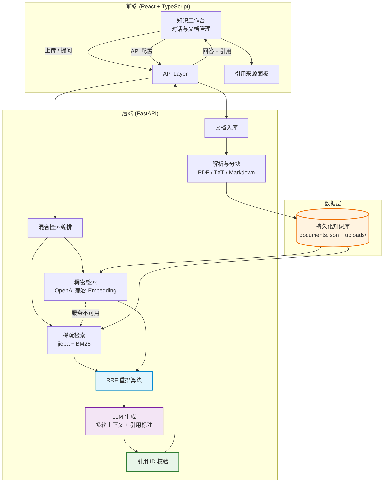

<div align="center">

# 🔍 知源 · Hybrid RAG Citation

### 基于混合检索、RRF 融合与可验证引用的文档知识工作台

[](https://www.python.org/)
[](https://fastapi.tiangolo.com/)
[](https://react.dev/)
[](https://www.typescriptlang.org/)
[](LICENSE)

</div>

---

## 📖 项目简介

知源是一个可实际使用的文档知识库：上传自己的 PDF、TXT 或 Markdown，系统完成解析与索引，再通过混合检索生成带有可核验原文引用的回答。

### ✨ 核心能力

- 📥 **真实文档入库** - 文件上传、文本提取、分块、持久化与删除
- 🔀 **混合检索引擎** - BM25 与 Embedding 双路召回，使用 RRF 融合排序
- 🛟 **自动降级** - Embedding 在建索引或查询阶段不可用时保留 BM25 检索能力
- 🔗 **可验证引用** - 只接受回答中实际出现且属于本次检索结果的引用 ID
- 📄 **原文溯源** - 引用保留文件名和 PDF 页码，可直接打开原始文件
- 🗂️ **知识库工作台** - 展示文档状态、片段数量、文件大小并提供真实上传入口
- 💬 **多轮会话** - 最近 12 条有效消息参与问答，支持本地保存、重新开始和逐消息引用定位
- 🧹 **删除一致性** - 删除文档后同步清理来源面板，并在历史回答中标记已删除来源
- 🔑 **前端 API 配置** - 浏览器配置优先于服务器 `.env`，鉴权失败后可原地重试
- 🐳 **完整部署支持** - 提供 Docker Compose、健康检查和持久化数据卷

---

## 🏗️ 系统架构



---

## 🔄 使用流程

```text
上传文档 → 解析并分块 → 构建 BM25/向量索引
                            ↓
打开原文 ← 核验引用 ← 生成带引用的回答 ← 混合检索
```

---

## 🚀 本地启动

需要 Python 3.10+、Node.js 18+ 和 [uv](https://docs.astral.sh/uv/)。

1. 创建后端配置：

```bash
cp backend/.env.example backend/.env
```

2. 设置模型服务：

```env
LLM_API_KEY=your-key
LLM_BASE_URL=https://api.openai.com/v1
LLM_MODEL=gpt-4o-mini

EMBEDDING_API_KEY=your-key
EMBEDDING_BASE_URL=https://api.openai.com/v1
EMBEDDING_MODEL=text-embedding-3-small
```

LLM 与 Embedding 可以使用不同的 OpenAI 兼容服务。Embedding 配置不可用时系统会自动使用 BM25，但生成回答仍然需要可用的 LLM。

也可以点击界面右上角的“API 配置”直接填写。前端配置具有请求级最高优先级，密钥仅保存在当前标签页的 `sessionStorage`，关闭标签页后清除；它仍会发送到本项目后端，请只在可信部署环境中使用。

3. 安装并启动：

```bash
cd backend
uv sync
uv run uvicorn app.main:app --reload --port 8002
```

在另一个终端运行：

```bash
cd frontend
npm install
npm run dev
```

访问 <http://localhost:5175>，API 文档位于 <http://localhost:8002/docs>。

也可以在仓库根目录运行 `./start.sh`，使用 `./stop.sh` 停止。

---

## 🐳 Docker 部署

配置好 `backend/.env` 后运行：

```bash
docker compose up --build -d
```

访问 <http://localhost:8082>。上传文件和知识库清单保存在 `knowledge_data` 数据卷中。

---

## 📚 API 文档

| 方法 | 路径 | 用途 |
| --- | --- | --- |
| `GET` | `/api/health` | 服务、文档数量与检索模式状态 |
| `GET` | `/api/documents` | 获取知识库文档 |
| `POST` | `/api/documents` | 上传并索引文档，字段名为 `file` |
| `POST` | `/api/documents/reindex` | 使用前端 Embedding 配置重建索引 |
| `DELETE` | `/api/documents/{id}` | 删除文档并刷新索引 |
| `GET` | `/api/documents/{id}/file` | 打开引用对应的原始文件 |
| `POST` | `/api/query` | 检索文档并生成引用回答 |

查询示例：

```bash
curl http://localhost:8002/api/query \
  -H 'Content-Type: application/json' \
  -d '{"query":"总结文档中的核心结论","top_k":6}'
```

---

## 📁 项目结构

```text
backend/
  app/api/                 API 与文档管理路由
  app/models/              请求、响应和知识库模型
  app/services/
    document_store.py      文件解析、持久化和分块
    sparse_retriever.py    BM25 检索
    dense_retriever.py     Embedding 检索
    rrf_fusion.py          RRF 排序融合
    hybrid_retriever.py    检索编排与降级
    llm_service.py         回答生成与引用校验
  tests/                   文档生命周期和引用测试
frontend/
  src/components/          对话、输入与引用面板
  src/services/            文档和问答 API
compose.yaml               单节点部署编排
```

---

## ✅ 质量检查

```bash
cd backend && uv run pytest -q
cd frontend && npm run lint && npm run build
```

---

## ⚠️ 数据与边界

- 默认上传上限为 25MB，可通过 `MAX_UPLOAD_MB` 调整。
- BM25 只保留与问题存在词项重合的片段；向量结果默认最低相似度为 `0.2`，可通过 `DENSE_MIN_SCORE` 调整。
- 知识库默认保存在 `backend/storage/`，该运行时目录不会提交到 Git。
- 当前持久化方案面向单节点部署。需要多实例或大规模文档时，可将文档元数据迁移到 PostgreSQL，并将向量索引迁移到 pgvector、Qdrant 等存储。
- 扫描版 PDF 需要额外接入 OCR；当前 PDF 解析提取文件内已有的文本层。

---

## 📄 License

[MIT](LICENSE)

---

<div align="center">

**⭐ 如果这个项目对你有帮助，请给个 Star！⭐**

</div>
